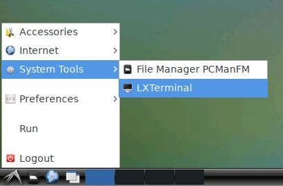

# Person detection example with Tensofrlow API  
## Installation
### First approach
First of all you need Linux machine with `Python3.7` and newer. Than do next steps:  
1. Go to project repository and create a virtual environment.  
    ```sh
    python3.7 -m virtualenv env
    . env/bin/activate
    ```
2. Run installation script
    ```sh
    chmod +x prepare.sh
    ./prepare.sh
    ```
### Second approach - using Docker
If you have a docker installed you can just follow below steps. **But be carefull - the size of the image is 5,5 Gb!**  
1.  `docker run -p 6080:80 -v /dev/shm:/dev/shm 4ku2/object-detection-example`   
2. Go to http://127.0.0.1:6080/ in your browser.  
3. Open terminal 
 
    
    
4.  Launch  
    ```sh
    cd /
    python3 recognition.py
    ```   
## Launch  
Run with default parameters
```sh
python3 recognition.py
```  
More general way  
```sh
python3 recognition.py --path path/to/video/file --model model_name
```  
For more information use help  
```sh
python3 recognition.py -h
```  

## Example 

